<p align="center">
  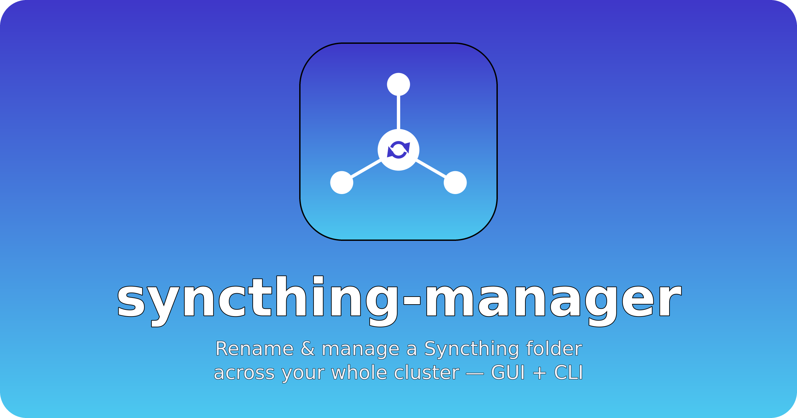
</p>

<p align="center">
  <a href="LICENSE"></a>
  
  <a href="https://github.com/gabildev/syncthing-manager/releases"></a>
  <a href="https://github.com/gabildev/syncthing-manager/actions/workflows/build.yml"></a>
</p>

<p align="center"><a href="README.md">English</a> · <strong>🌐 Español</strong></p>

Renombra y gestiona una **carpeta compartida de Syncthing en todo tu clúster** —su etiqueta,
su ruta en disco e incluso el **ID** de la carpeta— desde un único sitio. Sin editar
`config.xml` a mano en cada máquina, sin reiniciar servicios, sin conflictos de sincronización.

Trae **dos interfaces sobre el mismo motor**:

- 🖥️ **GUI** — una app de escritorio con un flujo de renombrado guiado, una **vista/editor de
  topología** en vivo de la carpeta a través de los dispositivos, gestión de credenciales y un
  panel de ejecución. Es la interfaz principal y más completa.
- ⌨️ **CLI** — comandos para scripts (`folders`, `discover`, `rename`, `topology`,
  `create-folder`, `share`, `unshare`, `delete-folder`, `undo`, `generate-agent`) para servidores
  sin escritorio y automatización.

## GUI vs CLI — quién hace qué

Mismo motor por debajo; la diferencia es la experiencia y unas pocas funciones solo-interactivas.

| Capacidad | 🖥️ GUI | ⌨️ CLI |
|---|:---:|:---:|
| Renombrado guiado — etiqueta / directorio / ruta absoluta / ID de carpeta | ✓ | ✓ |
| Descubrir dispositivos que comparten una carpeta | ✓ | ✓ |
| Ver la topología por-carpeta | ✓ grafo interactivo | ✓ impresa |
| **Editar** la topología — arrastrar enlaces, cambiar roles, ruta por-dispositivo, añadir dispositivos | ✓ | — solo lectura |
| Compartir / dejar de compartir una carpeta · crear una carpeta | ✓ | ✓ |
| **Borrar una carpeta** — de Syncthing y (opcionalmente) sus datos en disco, por-dispositivo o en todo el clúster | ✓ | ✓ |
| Deshacer el último rename · generar un agente offline | ✓ | ✓ |
| Pasiva — aplicar a dispositivos offline al reconectar | ✓ | ✓ |
| Gestión de credenciales | ✓ en la app, guardadas por dispositivo | `devices.yml` |
| `.stignore` por-dispositivo · pausar/reanudar · aceptar peticiones · candado de app | ✓ | — |
| Dry-run / previsualizar cambios antes de aplicar | ✓ | ✓ |
| No interactivo · headless · scripting / automatización | — | ✓ |

## Qué hace

- **Renombra en todo el clúster a la vez** — etiqueta, nombre de directorio / ruta absoluta y el
  **ID** de la carpeta, aplicado a cada dispositivo alcanzable.
- **Tres formas de llegar a un dispositivo** — la API REST de Syncthing, **SSH** (Linux, macOS,
  NAS y **Windows vía OpenSSH**) o **WinRM** (Windows): lee la config del nodo, encuentra la
  carpeta y aplica el cambio.
- **Vista y editor de topología** — el grafo real por-carpeta (dispositivos, roles, enlaces,
  online/offline); compartir/dejar de compartir, enlazar/desenlazar dispositivos, cambiar roles de
  envío/recepción, fijar una ruta por-dispositivo, añadir dispositivos.
- **Dispositivos offline** — el cambio se aplica en cuanto reconectan (**exploración pasiva**), o
  vía un **agente** generado que ejecutas en un equipo sin acceso remoto.
- **Seguro por diseño** — dry-run, comprobaciones de pre-vuelo (validez de ruta, destino
  existente, movimientos entre sistemas de archivos, colisiones de ID), reparación de `.stfolder`,
  pausa/reanudación automáticas y **deshacer**. Un rename nunca borra tus datos; borrar una carpeta
  es una acción aparte y con confirmación explícita.
- **Config de agente cifrada** y almacenamiento de credenciales persistente y **por-dispositivo**.

## Instalación

**Descarga un build** desde [Releases](https://github.com/gabildev/syncthing-manager/releases)
para tu plataforma, descomprímelo y ejecuta el binario dentro de la carpeta `syncthing-manager/`
— **sin Python** (es un paquete **onedir** autónomo: una carpeta, no un instalador). En Linux
puedes dejar la carpeta en `/opt` y crear un symlink en tu `PATH` — ver
[Instalar como comando del sistema](#instalar-como-comando-del-sistema-linux). Para compilar el
tuyo, ver [Compilar binarios](#compilar-binarios).

> ℹ️ Linux y Windows son los más probados. Los builds de **macOS** (Intel + Apple Silicon) se
> proveen y el código trata macOS como POSIX de primera clase, pero han tenido menos pruebas
> reales — se agradecen los reportes.

**Desde el código** (para desarrollo, o una plataforma sin binario precompilado):

```bash
git clone https://github.com/gabildev/syncthing-manager
cd syncthing-manager
pip install -e .          # añade ".[dev]" para los extras de test/compilación (pytest, pyinstaller)
```

**Requiere Python 3.10+.** La GUI necesita Tk (`python3-tk` en Debian/Ubuntu; ya incluido en las
builds de python.org para Windows/macOS).

## Requisitos

- **Syncthing ≥ 1.12** en los dispositivos que gestiones (para la API REST de configuración por objeto; las versiones anteriores se manejan vía SSH/WinRM).
- La API REST de Syncthing **local** alcanzable (por defecto `https://127.0.0.1:8384`); la
  herramienta autodetecta la API key de la config local cuando puede.
- Para configurar dispositivos **remotos** sin aceptar manualmente en cada uno, da un canal: la
  API key + URL del remoto, credenciales **SSH** o credenciales **WinRM**. Los dispositivos sin
  canal se manejan de forma pasiva (al reconectar) o por un agente.

## Recorrido rápido por la GUI

```bash
syncthing-manager-gui
```

1. **Conexión** — apunta al Syncthing local (autodetectado), elige una carpeta.
2. **Dispositivos** — revisa los dispositivos descubiertos; añade credenciales SSH/WinRM/API
   (con «probar y conectar»), examina una clave SSH, elige el SO de cada dispositivo
   (autodetectado cuando es alcanzable).
3. **Nombres** — elige la nueva etiqueta, la ruta en disco y/o el ID de carpeta (cada uno por
   separado).
4. **Topología** — inspecciona y edita el grafo por-carpeta: clic derecho en un nodo para dejar
   de compartir la carpeta / desenlazar el dispositivo / editarlo; arrastra para añadir o cortar
   enlaces; fija roles. Los cambios se muestran como un diff y se aplican solo donde es
   alcanzable (el resto van por pasiva/agente).
5. **Vista previa y Ejecutar** — una previsualización por-dispositivo de exactamente qué va a
   cambiar, y luego ejecútalo con un panel de progreso/resultados en vivo y un botón de
   reintento.

<details>
<summary><h3>📸 Capturas</h3></summary>

**1 · Conexión** — apunta al Syncthing local y conecta

<p align="center">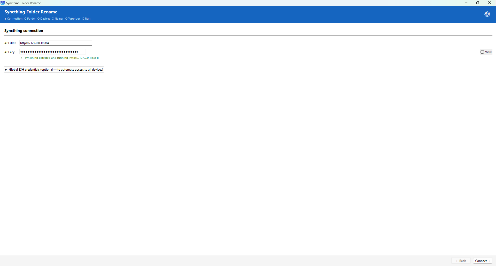</p>

**2 · Carpeta** — elige una carpeta, o crea una nueva

<p align="center">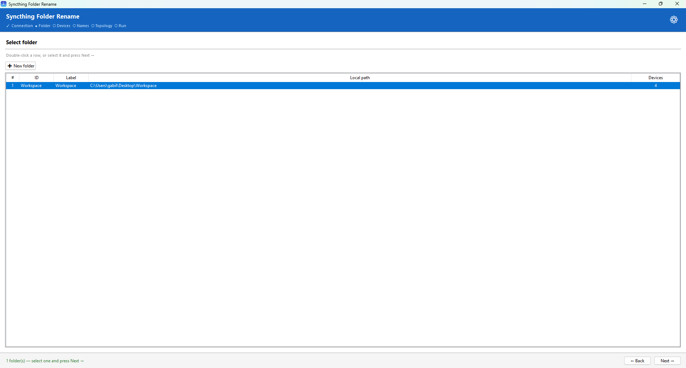</p>
<p align="center">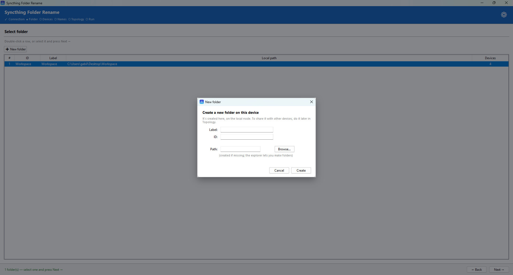</p>

**3 · Dispositivos** — dispositivos descubiertos; credenciales SSH/WinRM/API por dispositivo, sincronizar nombres y gestión de equipos offline vía agente / exploración pasiva

<p align="center">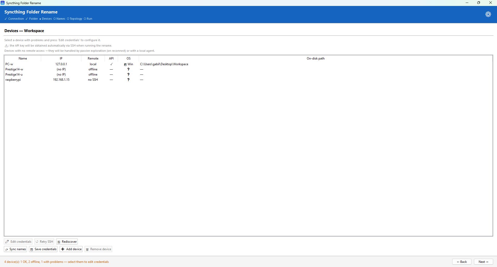</p>
<p align="center">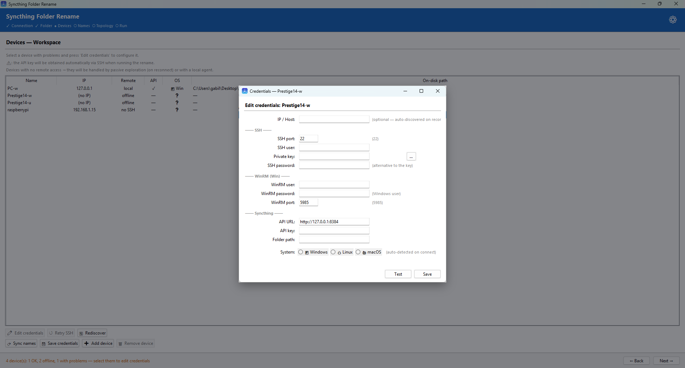</p>
<p align="center">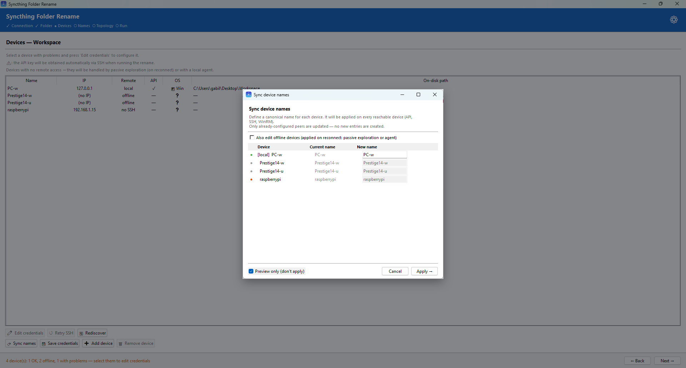</p>
<p align="center">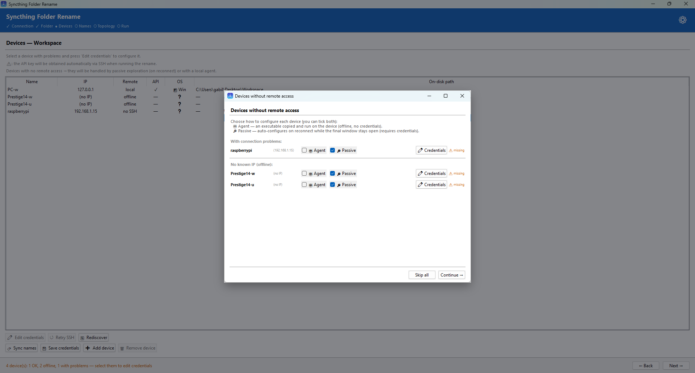</p>

**4 · Nombres** — elige el nuevo label, la ruta en disco y/o el ID de carpeta

<p align="center">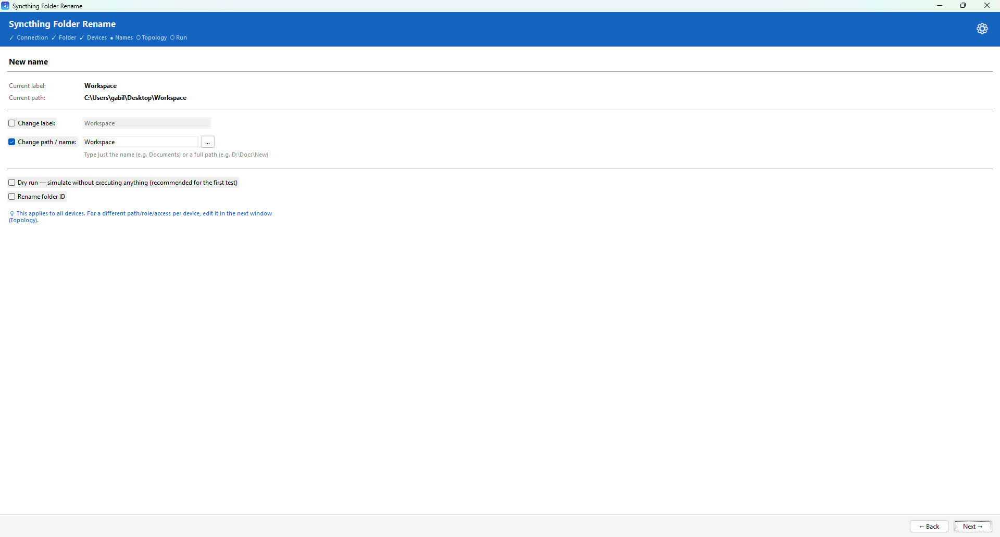</p>

**5 · Topología** — inspecciona y edita el grafo por carpeta; añade dispositivos

<p align="center">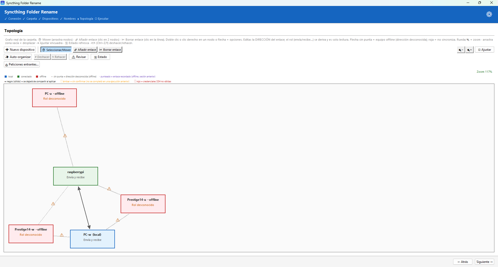</p>
<p align="center">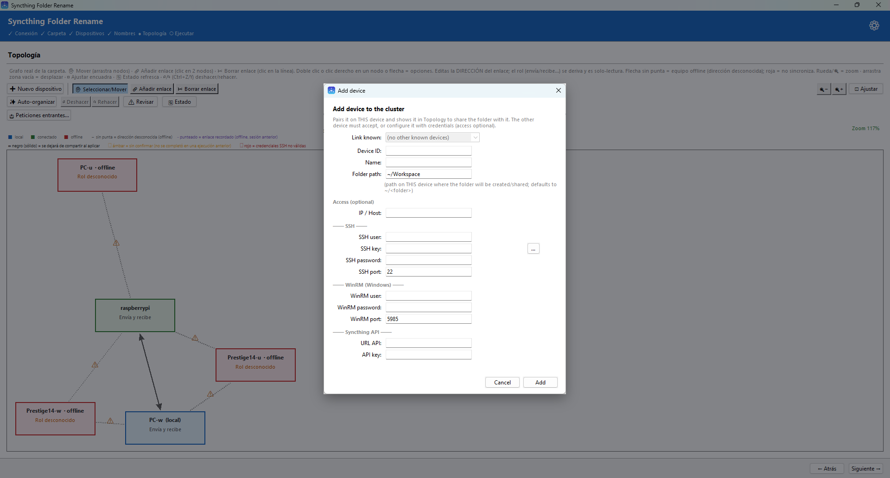</p>

**6 · Ejecutar** — simulación o ejecución con log en vivo, y generación de agentes para equipos offline. El SO y la arquitectura de CPU de cada equipo se autodetectan (o los eliges por dispositivo), así se compila el binario correcto — Windows / Linux / macOS, amd64 / arm64

<p align="center">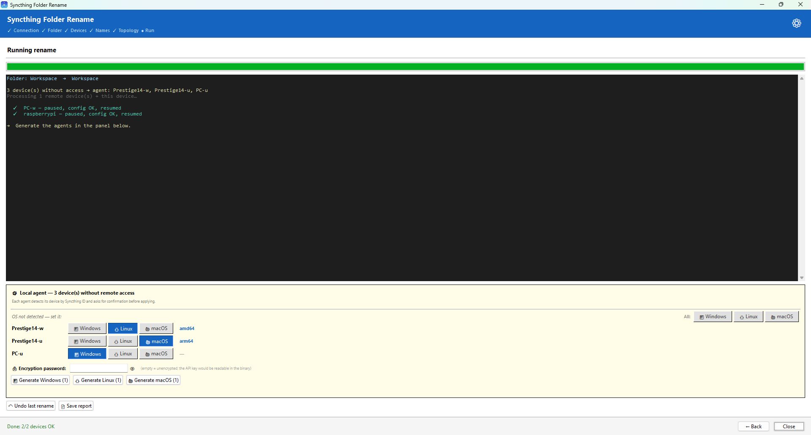</p>

**Ajustes** — seguridad, idioma, puertos por defecto y el candado opcional

<p align="center">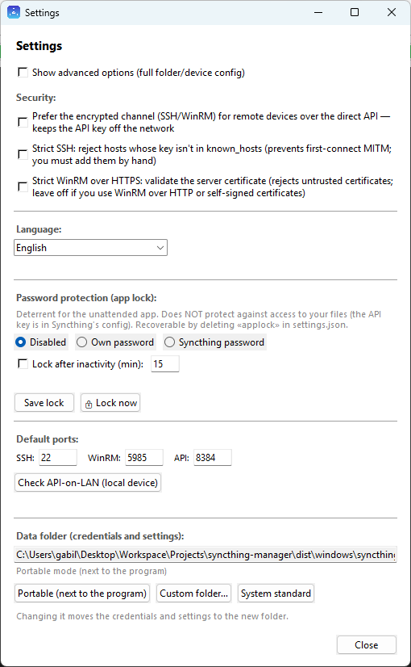</p>

</details>

## CLI

```bash
syncthing-manager --help
```

| Comando | Qué hace |
|---|---|
| `folders` | Lista las carpetas del nodo local. |
| `discover` | Descubre todos los dispositivos que comparten una carpeta (solo lectura). |
| `rename` | Renombra la etiqueta / ruta / ID de una carpeta en todo el clúster. |
| `topology` | Imprime la topología real por-carpeta (dispositivos, roles, enlaces, inconsistencias). |
| `create-folder` | Crea una carpeta nueva en este equipo (local) y la registra en Syncthing; compártela después con `share`. |
| `share` | Comparte una carpeta con un dispositivo — lo añade a la membresía en este equipo (o en un miembro alcanzable con `--with`). |
| `unshare` | Deja de compartir una carpeta con un dispositivo en todo el clúster (solo config — nunca borra archivos). |
| `delete-folder` | **Destructivo:** quita una carpeta de Syncthing y (salvo `--keep-data`) borra sus datos en disco, por-dispositivo o en todo el clúster. Rechaza rutas protegidas / carpetas sin marcador `.stfolder` y exige teclear el nombre de la carpeta para confirmar. |
| `undo` | Revierte el último renombrado (etiqueta, ruta y el ID de carpeta si cambió). |
| `generate-agent` | Compila un ejecutable de agente para un dispositivo sin acceso SSH/WinRM. |
| `gui` | Abre la interfaz gráfica de escritorio. |

### Ejemplos de rename

```bash
# Interactivo
syncthing-manager rename

# No interactivo (scripts)
syncthing-manager rename -f my-folder-id -l "Nueva Etiqueta" -d "nuevo-nombre-dir" --no-confirm

# Ver qué pasaría, sin cambiar nada
syncthing-manager rename --dry-run

# Solo la etiqueta; conservar la ruta en disco
syncthing-manager rename --skip-path-rename -l "Nueva Etiqueta"

# Cambiar también el ID de la carpeta
syncthing-manager rename -f old-id --new-folder-id new-id

# Seguir esperando a los dispositivos offline y aplicar al reconectar (Ctrl-C para parar)
syncthing-manager rename --passive

# Solo esta máquina
syncthing-manager rename --local-only
```

Opciones clave de `rename`: `--folder/-f`, `--label/-l`, `--dir-name/-d`, `--new-folder-id`,
`--api-key/-k`, `--url`, `--config/-c devices.yml`, `--dry-run`, `--no-confirm`,
`--local-only`, `--skip-path-rename`, `--passive`. Flag global (antes de cualquier comando):
`--lang es|en` para el idioma de la interfaz.

## devices.yml — overrides de credenciales

Cuando la autodetección no basta (autenticación por contraseña, rutas de config no estándar,
WinRM, etc.), aporta un `devices.yml` y pásalo con `--config` (CLI) o cárgalo desde la GUI:

```yaml
defaults:
  ssh_user: ubuntu
  ssh_key_path: ~/.ssh/id_rsa

devices:
  - name: nas
    ssh_host: 192.168.1.20
    ssh_user: admin
    syncthing_config_path: /volume1/@appstore/syncthing/var/config.xml

  - device_id: "XXXXXXX-..."
    name: winbox
    winrm_host: 192.168.1.30
    winrm_user: Administrator
    winrm_password: "..."
```

Ver `devices.example.yml`. La GUI también guarda las credenciales por dispositivo para no tener
que reintroducirlas; los `devices.yml` reales están en `.gitignore`.

## Agentes para dispositivos inalcanzables

Para un dispositivo sin canal API/SSH/WinRM, genera un agente autónomo y ejecútalo allí:

```bash
syncthing-manager generate-agent --os windows                 # o: --os linux / --os macos
# Para un destino Linux/macOS con una CPU distinta, elige la arquitectura
# (por defecto: la del host en Linux; en macOS la embebida — amd64, si no arm64):
syncthing-manager generate-agent --os linux --arch arm64       # p. ej. una Raspberry Pi de 64 bits
syncthing-manager generate-agent --os macos --arch arm64       # p. ej. un Mac con Apple Silicon
```

El agente lleva las instrucciones (opcionalmente cifradas), aplica el renombrado en local y
verifica la identidad por el ID de dispositivo de Syncthing. Las plantillas de agente se
compilan desde `build/agent_*.spec`.

## Compilar binarios

```bash
# Windows (desde una máquina Windows) — compila la plantilla de agente y luego el exe principal
build\build_windows.bat

# Linux
build/build_linux.sh

# macOS (desde un Mac) — el mismo onedir + plantilla de agente, como binario Mach-O
build/build_macos.sh

# Cualquiera, con --no-package: compila solo la carpeta onedir, salta el .zip/.tar.gz
# (iteración más rápida al testear — alias --no-pack / --skip-package)
build/build_linux.sh --no-package
```

La app principal se compila en **onedir** (una carpeta, no un exe autoextraíble) para un
arranque rápido, y los scripts la empaquetan como `syncthing-manager-windows.zip` /
`syncthing-manager-linux.tar.gz` — descomprime y ejecuta el binario de dentro (pasa
`--no-package` para saltarte ese paso de archivo al testear). Las **plantillas de agente** para
dispositivos offline quedan en un único archivo (copias una a un dispositivo y la ejecutas).
Ambos scripts limpian sus propios temporales al terminar, dejando solo `dist/` y las fuentes.

**Embeber agentes para otras plataformas.** Una compilación local solo embebe la plantilla de
agente de **su propio** SO y arquitectura de CPU, así que por sí sola puede generar agentes
únicamente para esa plataforma. Para que tu build también genere agentes para los **otros**
dispositivos de tu clúster (Windows, la otra arquitectura de Linux, macOS), consigue esos ficheros
`syncthing-manager-agent-template-*` — descárgalos de los assets de una
[Release de GitHub](https://github.com/gabildev/syncthing-manager/releases), o compílalos en esas
máquinas — y colócalos en **`build/prebuilt/`** antes de ejecutar el script. Es el almacén
persistente del que la build lee las plantillas cross‑OS (los scripts también guardan ahí las suyas
recién compiladas); la build embebe lo que encuentre. No uses `dist/` para esto: las plantillas que
la build deja en `dist/` se borran justo después de embeberse, así que `dist/` nunca las conserva.
Los ficheros de plantilla no se pueden ejecutar por sí solos; existen solo para embeberse.

<details>
<summary><strong>CI y automatización de releases</strong></summary>

El CI (`.github/workflows/build.yml`) compila las plantillas de agente y los ejecutables
principales en cada push de tag (`v*`) y adjunta `syncthing-manager-windows.zip`,
`syncthing-manager-linux-amd64.tar.gz`, `syncthing-manager-linux-arm64.tar.gz`,
`syncthing-manager-macos-amd64.tar.gz`, `syncthing-manager-macos-arm64.tar.gz` (más un
`SHA256SUMS.txt`) y todas las plantillas de agente (Windows, Linux ×2, macOS ×2) a una
**Release de GitHub** automáticamente. (Un `build_*.sh` local produce un único tarball
sin-sufijo para la arquitectura del host.) Cada binario principal embebe *todas* las plantillas
de agente, así que la release de cualquier plataforma puede generar agentes para Windows, Linux
y macOS. Etiqueta una release con p. ej. `git tag v1.0.0 && git push --tags`; ejecútalo a mano
desde la pestaña Actions (`workflow_dispatch`) para compilar artefactos sin publicar. Las
salidas de compilación (`dist/`, `build_tmp/`) están en `.gitignore`.

</details>

### Instalar como comando del sistema (Linux)

La build es **onedir**: el binario `syncthing-manager` necesita los archivos de al lado (su
runtime `_internal/`), así que no puedes copiar el binario solo a `/usr/local/bin`. Mueve la
**carpeta entera** y crea un symlink del binario en tu `PATH`:

```bash
# De una Release de GitHub elige tu arquitectura: -linux-amd64 (PC/WSL) o -linux-arm64 (Pi 64-bit).
# (Un build_linux.sh local produce el syncthing-manager-linux.tar.gz sin sufijo.)
tar -xzf syncthing-manager-linux-amd64.tar.gz
sudo mv syncthing-manager /opt/syncthing-manager
sudo ln -s /opt/syncthing-manager/syncthing-manager /usr/local/bin/syncthing-manager
```

Ahora `syncthing-manager` es un comando global. Una terminal siempre es el CLI: el comando a
secas en un shell muestra la ayuda, cualquier subcomando se ejecuta, y `syncthing-manager gui`
abre la GUI; la GUI también se abre con doble-clic / lanzador de escritorio (un arranque a secas
sin terminal detrás). El binario resuelve el symlink para encontrar sus librerías, y
como `/opt` no es escribible por el usuario, los datos de cada usuario van a su propio
`~/.config/syncthing-manager/` automáticamente — binario compartido, config por-usuario.
(Instálalo en una ruta **escribible** en su lugar, p. ej. `~/apps/…`, y se mantiene *portable*,
guardando sus datos dentro de su propia carpeta.)

> ¿Prefieres una instalación limpia desde el código? `pip install .` pone `syncthing-manager`
> (CLI) y `syncthing-manager-gui` (GUI) directamente en tu `PATH` y usa `~/.config`. El binario
> onedir es para distribuir **sin** requerir Python.

## Estructura del proyecto

```
syncthing_manager/
  cli.py          CLI Typer (los comandos de arriba)
  _dispatch.py    Lógica de arranque CLI-vs-GUI (terminal → CLI; doble-clic a secas → GUI)
  gui/            Paquete de la GUI Tkinter — shell de la app + un módulo por página:
                    app.py, common.py, settings.py, page_connect.py, page_folder.py,
                    page_devices.py, page_names.py, page_topology.py, page_execute.py
  applock.py      Candado opcional de la GUI (bloquear ya + auto-bloqueo por inactividad; off por defecto)
  discovery.py    Descubrimiento de dispositivos en paralelo (API/SSH/WinRM, expansión por hub)
  renamer.py      Motor central: rename, aplicar/diff de topología, share/unshare, unlink, pre-vuelo
  topology.py     Modelo puro del grafo de topología (sin tkinter — usado por GUI y CLI)
  syncthing.py    Cliente de la API REST de Syncthing
  ssh_ops.py      Operaciones SSH (paramiko)
  winrm_ops.py    Operaciones WinRM (pywinrm)
  agent.py        Generación/runtime del agente
  generate.py     Empaquetado del ejecutable de agente
  device_names.py Sincronización de nombres de dispositivo
  credentials.py  Almacenamiento persistente de credenciales por-dispositivo
  config.py       Config de la app y directorio de datos (incl. preferencia de idioma)
  models.py       Dataclasses (DeviceInfo, FolderConfig, resultados)
  validation.py   Validación de rutas/nombres (POSIX vs Windows)
  i18n.py         Detección de idioma + traducciones (inglés/español)
  translations_en.py  Tabla de traducción al inglés (las cadenas fuente en español son las claves)
build/            Specs de PyInstaller, scripts de compilación (las plantillas de agente precompiladas se generan/sincronizan, no se versionan)
tests/            Suite de pytest (lógica pura: renamer, topology, discovery, …)
docs/             Referencia reutilizable: API REST de Syncthing, conceptos/trampas, patrones de integración
```

## Tests

```bash
pip install -e ".[dev]"
pytest
```

## Solución de problemas

- **La API no es alcanzable en un remoto**: la GUI/API de Syncthing suele estar atada a
  `127.0.0.1`. Átala a la IP de la LAN, usa un canal SSH/WinRM (que llega a la API en el
  localhost del dispositivo), o recurre a pasiva/agente.
- **Falla el SSH**: confirma que `ssh user@ip` funciona a mano; pon la clave correcta en
  `~/.ssh/config` o en `devices.yml`; fija un puerto no estándar en `devices.yml`.
- **Remotos Windows**: soportados vía **SSH** (OpenSSH), **WinRM** (habilítalo en el destino) o vía un agente.
- **Un dispositivo queda pausado tras un error**: la herramienta lo reporta; reanúdalo desde la
  interfaz web de Syncthing, o con
  `curl -X POST -H "X-API-Key: <key>" "http://localhost:8384/rest/db/resume?folder=<id>"`.

## Documentación

`docs/` contiene notas de referencia reutilizables para construir herramientas sobre Syncthing —
destiladas del trabajo de integración de este proyecto, escritas para ser útiles también a apps
futuras (cada nota es bilingüe: inglés `.md` · español `.es.md`):

- [`docs/syncthing-rest-api.es.md`](docs/syncthing-rest-api.es.md) — los endpoints REST que se usan aquí, con la trampa de cada uno.
- [`docs/syncthing-concepts.es.md`](docs/syncthing-concepts.es.md) — IDs de dispositivo/carpeta, la estrategia de renombrado por ID-inmutable, ubicaciones de `config.xml`, roles, aceptación pendiente.
- [`docs/integration-patterns.es.md`](docs/integration-patterns.es.md) — alcance multicanal de dispositivos, descubrimiento/expansión por hub, agentes auto-extensibles, cifrado, empaquetado de arranque rápido.

## Contribuir

1. Haz fork y una rama: `git checkout -b feat/mi-funcionalidad`
2. Haz los cambios y añade tests
3. `pytest`
4. Abre un pull request

## Licencia

**MIT** — ver [`LICENSE`](LICENSE).

Los binarios distribuidos empaquetan librerías de terceros bajo sus propias licencias (permisivas);
las atribuciones están en [`THIRD_PARTY_LICENSES.md`](THIRD_PARTY_LICENSES.md), que también va
dentro de los archivos de la release. Nota: paramiko es **LGPL‑2.1** — conserva ese aviso al
redistribuir (el código fuente completo aquí ya satisface su cláusula de relink).
